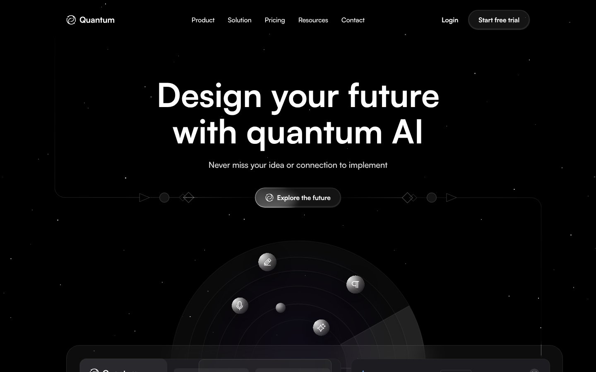

<div align="center">

# Quantum — AI Content Writing SaaS Website (Next.js + Tailwind CSS)

A futuristic, dark **AI SaaS landing page template** for an AI content-writing / copywriting tool — pixel-perfect from Figma, built with Next.js 16, React 19, TypeScript and Tailwind CSS v4.

[](https://content-writing-ai-website.vercel.app)




</div>

## ✨ Features

- ✅ Space-themed AI hero with animated product orbit
- ✅ Product UI mockups, use-cases and AI integrations section
- ✅ Pricing, testimonials and FAQ sections
- ✅ Self-hosted Satoshi font for fast loading
- ✅ All copy kept in `lib/content.ts` — easy to customise
- ✅ Responsive reflow from 1440px desktop to mobile

## 🛠 Tech Stack

Next.js (App Router) · TypeScript · Tailwind CSS · React · Vercel

## Development

Marketing home page for **Quantum**, an AI content‑writing product, implemented from the
[Figma design](https://www.figma.com/design/DgqCM2YiKV9qrtFhLsNT3A/Home).

## Stack

- Next.js 16 (App Router, React 19)
- TypeScript
- Tailwind CSS v4 — design tokens in `app/globals.css` (`@theme`)
- Satoshi, self‑hosted via `next/font/local`

## Development

```bash
npm install
npm run dev
```

Open http://localhost:3000.

```bash
npm run build   # production build
npm run lint    # eslint
```

## Structure

```
app/                 layout, page, global tokens, favicon
components/
  sections/          one component per page section (Navbar, Hero, Pricing, …)
  mockups/           the illustrative product UI panels shown in the design
  ui/                shared primitives (Button, Container, SectionHeading, …)
lib/content.ts       all copy, kept out of the components
public/assets/       SVG icons + images exported from Figma
public/fonts/        Satoshi woff2
```

Responsive: the Figma is desktop‑only (1440); layouts reflow to a single column below `lg`,
and the wider product mockups scale down with `zoom` / restack on small screens.


---

## 👤 Designer & Developer

**Noor Hossain** — UI/UX Designer & Front-End Developer (Next.js, React, Tailwind CSS) based in Dhaka, Bangladesh. I design in Figma and ship pixel-perfect, responsive, SEO-friendly websites.

[](https://github.com/nooruiux)
[](https://www.linkedin.com/in/noorxtk/)
[](https://www.behance.net/noorxtk)
[](https://dribbble.com/Noorxtk)

💼 **Available for freelance:** landing pages, SaaS websites, Figma-to-Next.js builds, UI/UX design. ⭐ Star this repo if it helped you.

<sub>Keywords: AI SaaS landing page, AI writing tool website, AI copywriting template, Next.js AI template, dark SaaS website design, Tailwind CSS v4, Figma to code, UI/UX design, responsive web design.</sub>
